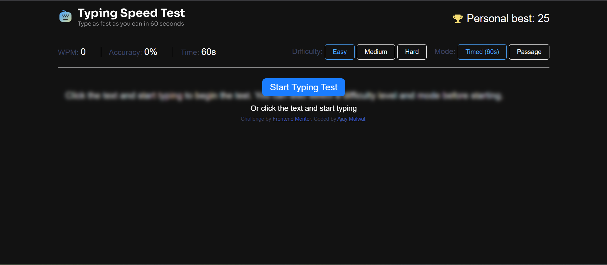
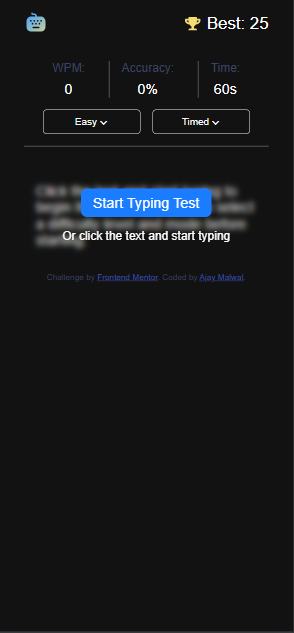

# Frontend Mentor - Typing Speed Test solution

This is a solution to the [Typing Speed Test challenge on Frontend Mentor](https://www.frontendmentor.io/challenges/typing-speed-test). Frontend Mentor challenges help you improve your coding skills by building realistic projects. 

## Table of contents

- [Overview](#overview)
  - [The challenge](#the-challenge)
  - [Screenshot](#screenshot)
  - [Links](#links)
- [My process](#my-process)
  - [Built with](#built-with)
  - [What I learned](#what-i-learned)
- [Author](#author)


## Overview

### The challenge

Users should be able to:

- View the optimal layout for the interface depending on their device's screen size
- See hover and focus states for all interactive elements on the page

### Screenshot



### Screenshot Mobile


### Links

- Solution URL: [Github Repo](https://github.com/Ajaymalwal/Frontend-Mentor---Typing-speed-test-solution)
- Live Site URL: [Live](https://your-live-site-url.com)

## My process

### Built with

- Semantic HTML5 markup
- CSS custom properties
- Flexbox
- CSS Grid
- Mobile-first workflow
- [Styled Components](https://styled-components.com/) - For styles

### What I learned

Learned how to calculate WPM, accuracy.
```
    function computeAndUpdateStats() {
        const now = startTimestamp ? Date.now() : null;
        const minutesElapsed = startTimestamp ? Math.max((now - startTimestamp) / 60000, 1/60) : 0; // avoid div by zero
        const wpmRaw = minutesElapsed ? (correctChars / 5) / minutesElapsed : 0;
        const accuracy = typedChars ? Math.min(100, (correctChars / typedChars) * 100) : 0;
        Test_Wpm.textContent = Math.round(wpmRaw);
        Test_Accuracy.textContent = Math.round(accuracy) + '%';
        return { wpm: wpmRaw, accuracy: accuracy };
    }
```

How to use localStorage to store personal best Score.

``` 

let personalBestValue = Number(localStorage.getItem('personalBest')) || 0;
```

Use of picture in html for responsive designing

```
 <picture>
    <source media="(max-width: 768px)" srcset="./assets/images/logo-small.svg">
    
</picture>
```


## Author

- GitHub - [Ajay Malwal](https://github.com/ajaymalwal)
- Frontend Mentor - [@AjayMalwal](https://www.frontendmentor.io/profile/ajaymalwal)
- LinkedIn - [@AjayMalwal](https://www.linkedin.com/in/ajay-malwal)


